# Match HIRED 🚀

**Match HIRED** is a multi-agent AI-powered recruitment platform designed to eliminate inefficiencies in startup hiring. By automating resume screening, interviews, and candidate ranking, Match HIRED helps startups reclaim time, reduce hiring risk, and make better talent decisions — with **zero upfront cost** and **purely performance-based pricing**.
> **Swipe left on bad hires. Swipe right on the future of recruitment.**

### Technical Stack Overview
<figure align="center">
  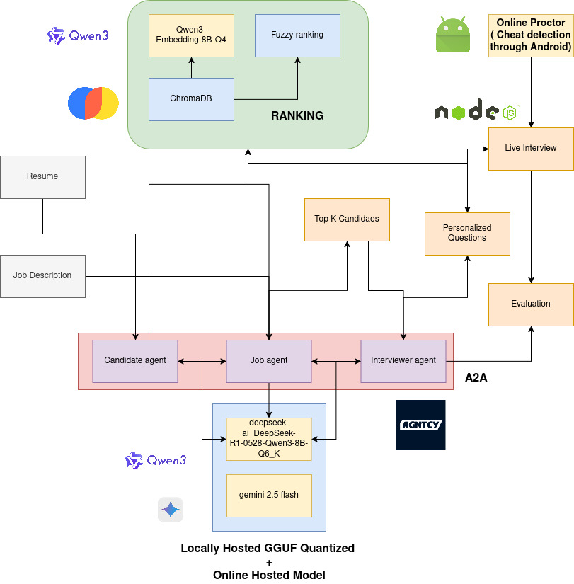
</figure>

---
## ❌ Problem Statement

Startups are losing their most valuable assets:

### ⏱ Time
- Founders spend **~40% of their time** screening irrelevant resumes instead of building products.

### 💸 Cash
- Average tech hire costs **$20,000+**.
- A **bad hire** can cost over **$250,000** in lost salary, productivity, and opportunity.

### 🔁 Broken Hiring Model
- Traditional recruiters charge **20–30% upfront fees**.
- No accountability.
- No alignment with startup success.

---

## ✨ Solution Overview

Match HIRED replaces manual hiring pipelines with an **AI-driven, multi-agent recruitment system** that:

- Automatically screens every candidate
- Conducts AI-led interviews
- Scores and ranks candidates objectively
- Charges **only when a successful hire is made**

**Zero Upfront Cost. Zero Risk. Pure Performance.**

---

## 🔄 How It Works

### Step 1: CONNECT
- Employers post a Job Description (JD)
- AI instantly analyzes applicants against the ideal profile
- Candidates receive mock interviews and personalized feedback

### Step 2: SHORTLIST
- Candidates are screened, scored, and ranked
- Employers receive a **hyper-curated shortlist** of top **N** candidates
- Includes strengths, weaknesses, and interview insights

### Step 3: SWIPE & HIRE
- Employers swipe through top candidates
- Hire with confidence
- Pay **only after successful onboarding**

---
## 🎬 Demo

### 👤 Candidate Profile Flow

  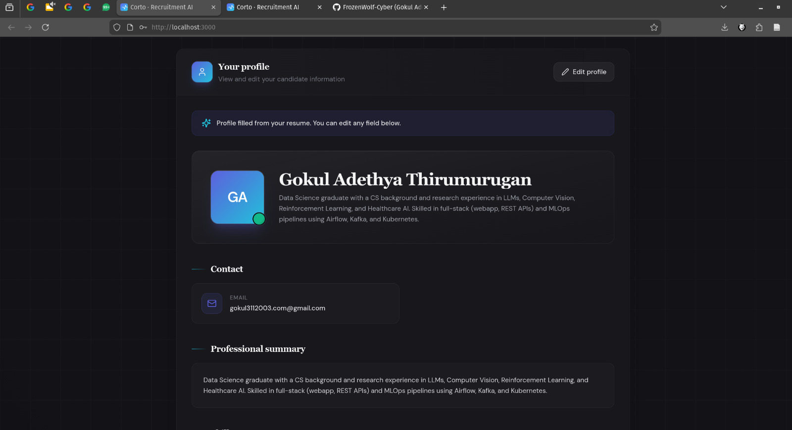 
  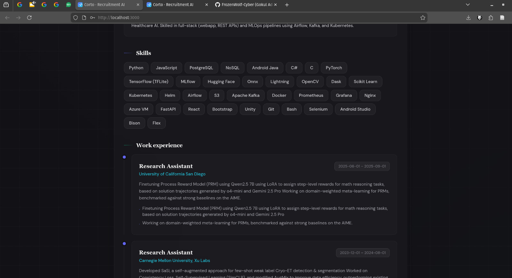 
  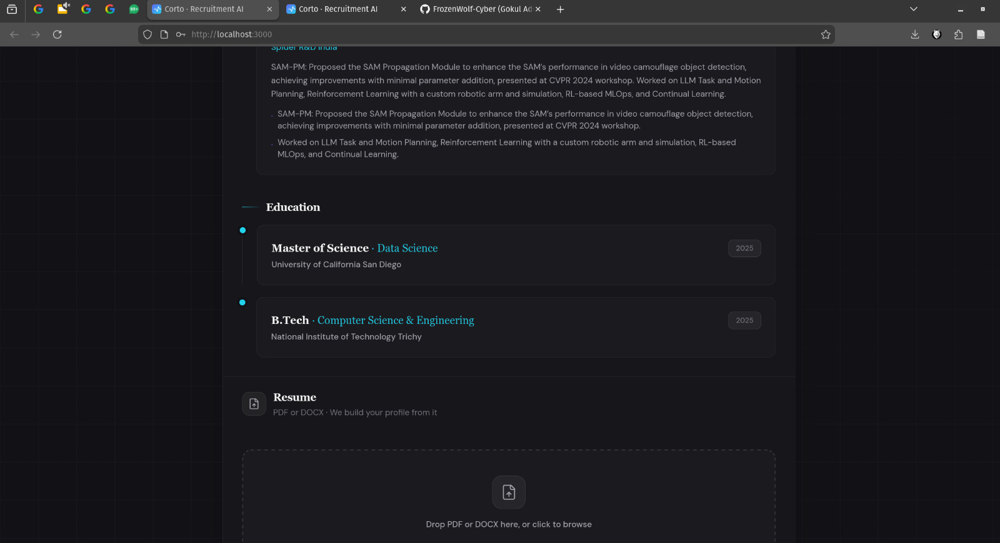

  <em>Candidate profile creation, skill extraction, and AI-driven evaluation</em>

---

### 🎤 Live AI Interview & Opportunities

  
  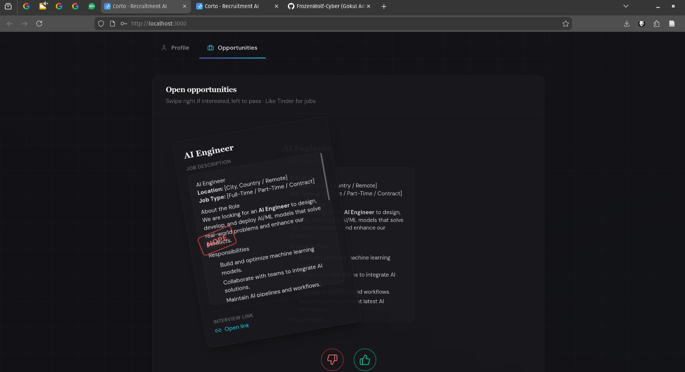

<em>AI-led interview experience and personalized opportunity recommendations</em>

  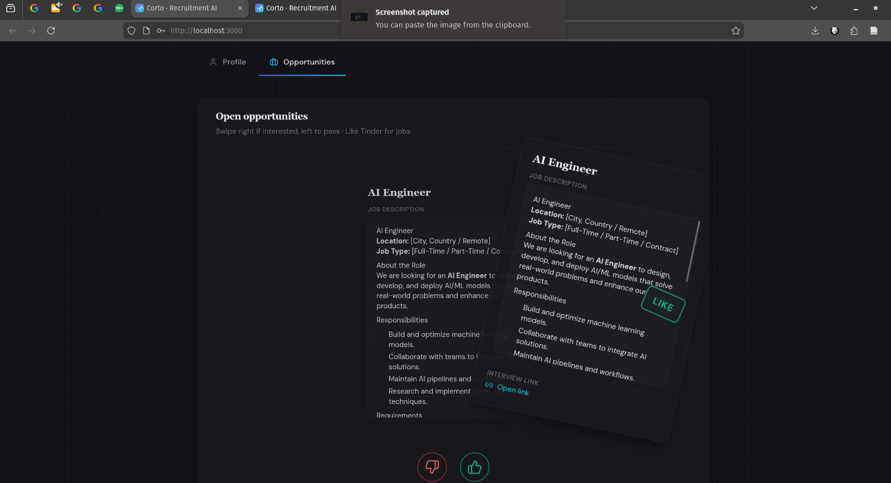

<em>Ranked job opportunities based on interview performance</em>

---

### 📱 Android Proctoring & Interview App

  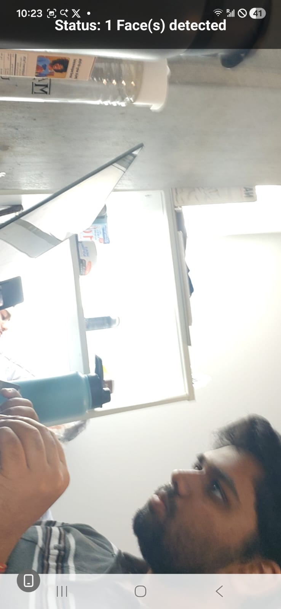
  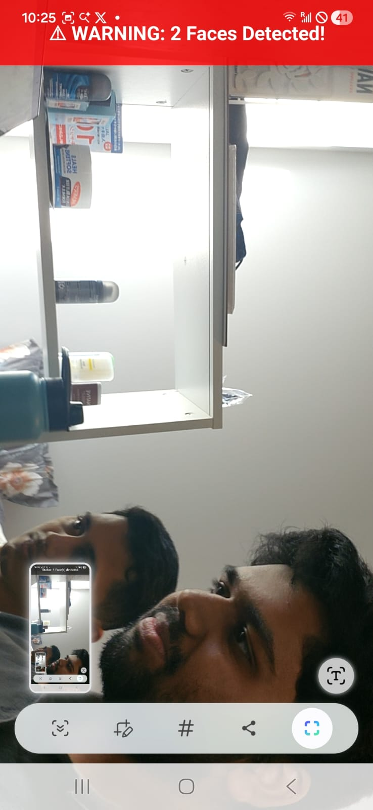

<em>Android-based interview interface with integrated proctoring</em>

---
## 🛠 System Architecture & Engine Diagrams

Match HIRED is built as a **Multi-Agent System (A2A)** coordinated through a central hub called **The Exchange**.
**The Exchange** orchestrates communication, task routing, and decision flow between specialized agents.

### Engine Components
<figure align="center">
  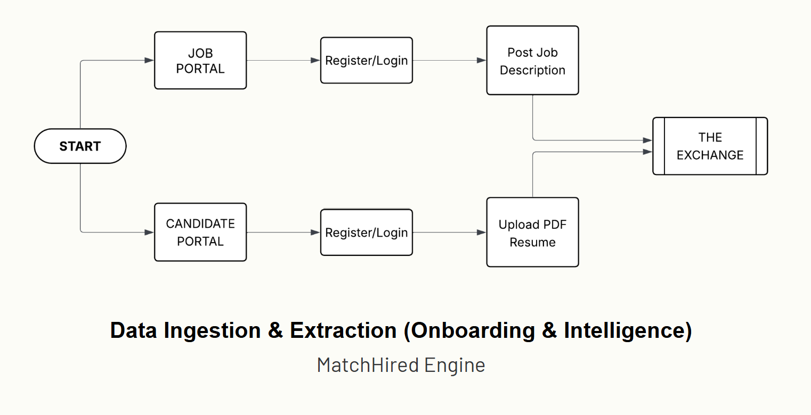
</figure>

<figure align="center">
  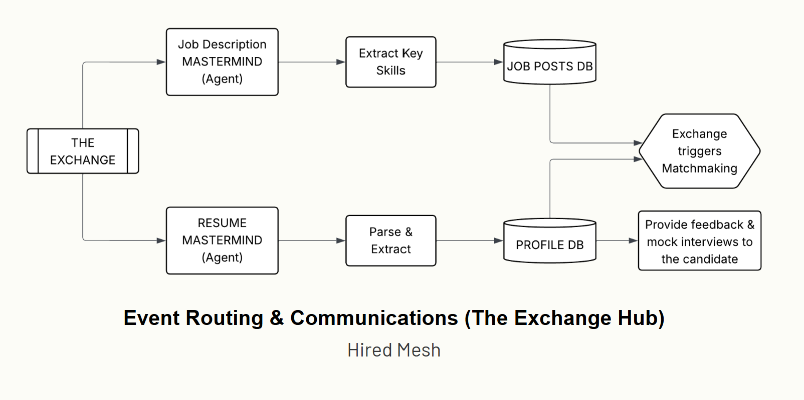
</figure>

<figure align="center">
  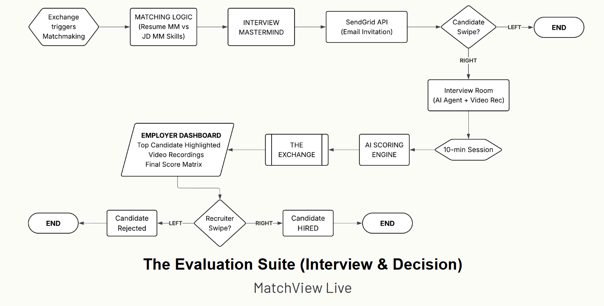
</figure>

---

## 🤖 Multi-Agent Design

### Multi-Agent Architecture
<figure align="center">
  
</figure>

### 🧠 The Exchange (Core Orchestrator)
- Coordinates all agent interactions
- Routes events and messages
- Sends interview invitations and notifications

### 👤 Candidate Agent
- Parses resumes (PDF/DOC)
- Extracts skills, experience, and profile metadata
- Performs fuzzy skill matching and ranking

### 💼 Job Agent
- Parses Job Descriptions
- Extracts required skills and role expectations
- Computes candidate–job fit scores

### 🎤 Interview Agent
- Generates personalized interview questions
- Conducts **10-minute AI-led interviews**
- Scores candidates based on responses, confidence, and relevance

---

## 📈 System Flow

### 1️⃣ Onboarding & Intelligence
- Employers and candidates register via their portals
- Profiles and job posts are ingested into databases
- Embeddings are generated for semantic matching

### 2️⃣ Event Routing (The Exchange)
- Agents communicate via the Exchange Hub
- Interview links are sent automatically
- State and progress are centrally managed

### 3️⃣ Evaluation & Decision
- Live interview scoring
- Final Score Matrix generated
- Employers review candidates via dashboard and **swipe to hire**

---

## 🧪 Technical Stack

### 🧠 Large Language Models
- **Gemini 2.5 Flash**
- **DeepSeek-R1-0528**
- **Qwen3** (GGUF quantized, local inference)

### 🗂 Vector Database
- **ChromaDB** — embeddings, similarity search, ranking

### ⚙ Infrastructure
- **Node.js** backend
- **SendGrid API** — interview invitations & notifications
- **Android-based proctoring** — cheat detection during interviews

---

## 💰 Business Model

| Feature | Traditional Recruiters | Match HIRED |
|------|----------------------|-------------|
| Risk | High (pay regardless) | **ZERO** |
| Cost | 20–30% upfront | **10–15% success fee** |
| Incentive | Quantity over quality | **Best hire wins** |
| Outcome | Misaligned | **Win–Win Partnership** |

---

## 👥 Team

- **Indresh Pradeepkumar** – Software Developer  
- **Gokul Thirumurugan** – ML Engineer  
- **Srivatsan Sarvesan** – ML Engineer  
- **Shashank Reddyhalli Rakesh** – ML Engineer  

---

## 🌟 Vision

We’re not just fixing hiring — **we’re redefining it**.

Match HIRED aims to become the **default hiring OS for startups**: fast, fair, intelligent, and aligned with success.

> **Build teams, not pipelines.**
